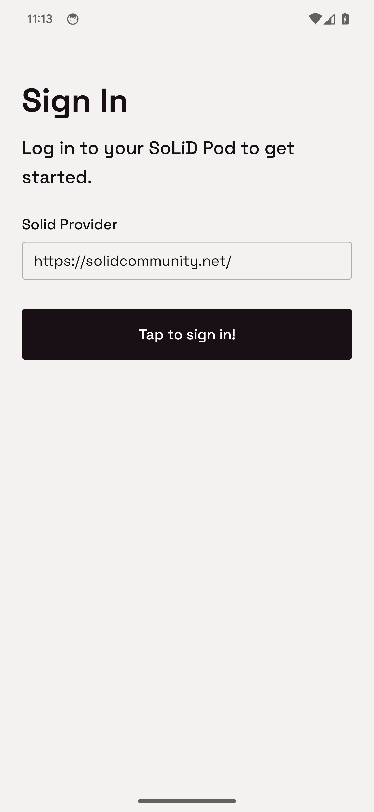

# Taking Care of Your Data: A SoLiD-based Mobile App for Wearable Data Collection and Visualization

## Showcase
Below are some screenshots and videos showcasing the app's features.
### SoLiD Authentication


In order to use the app, the user needs to authenticate with a SoLiD Pod. The app uses the **SoLiD OIDC authentication** flow to authenticate the user.

The user is redirected to the SoLiD Pod's authentication page, where the user can log in and grant the app access to the Pod.

After the user has authenticated, the app receives an access token, which is used to access the user's data on the Pod.

see the files [AuthenticationStore.ts](app/models/AuthenticationStore.ts) and [LoginScreen.tsx](app/screens/LoginScreen.tsx) for implementation details.

<br clear="right"/>

### Connecting Wearables
The Application connects to BLE wearable devices described with [W3C WoT Thing Descriptions](https://www.w3.org/TR/wot-thing-description11/). See the [tds](tds) folder for examples of Thing Descriptions for different wearables.

https://github.com/derwehr/WearableSolid/assets/7078901/6b3a02ac-d977-49f4-8393-34b256ddcd28

After connecting to a wearable, users can browse the Thing's available [Interaction Affordaces](https://www.w3.org/TR/wot-thing-description11/#interaction-affordances), subscribe to Events Affordances and read Property Affordances.

https://github.com/derwehr/WearableSolid/assets/7078901/3cdc5a95-3fda-415f-9b4d-2e6abf4f76b4

### Live Data Visualization

Subscribed Events are visualized in real-time using the [Victory Native](https://formidable.com/open-source/victory/docs/native/) library.

https://github.com/derwehr/WearableSolid/assets/7078901/f9a2d0bb-1ca9-449b-8fa4-a6500d1c3acd

### SoLiD Data Storage

The User may store the collected data in [SoLiD PODs](https://solidproject.org/). The data is stored in a [Turtle](https://www.w3.org/TR/turtle/).
Stored data is also visualized to allow analyzing historical data comprehensively. 

https://github.com/derwehr/WearableSolid/assets/7078901/4b8a55ef-b641-49b7-a69c-1109ad27e9a7

## Installation
The app is built using [React Native](https://reactnative.dev/) and [Expo](https://expo.io/). To run the app, you need to have Node.js and npm installed.

1. Clone the repository
2. Install the dependencies
    ```bash
    npm install
    ```
3. Start the app
    ```bash
    npm start
    ```
    This will start the Expo development server and open the Expo DevTools in your browser. You can then run the app on an emulator or on your phone using the Expo Go app.
